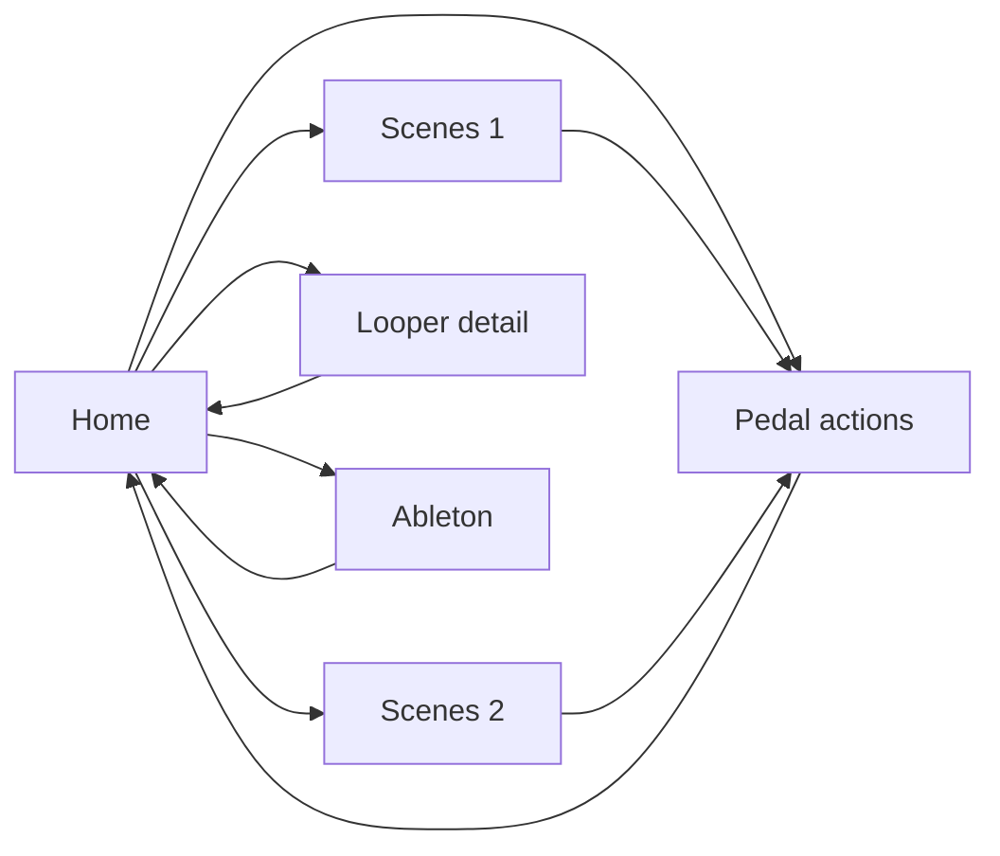

# The MC6 as an instrument — Controls design

*2026-08-16. Companion to `DESIGN-v2.md` (pedal state, presets, the message
budget) and `DESIGN-LOOPER.md` (Itajara).*

This describes what the Controls page should become. It is written from the
workflow forward. The MC6's current contents are not evidence of intent — they
are a record of what could reasonably be programmed by hand in Morningstar's
editor, which is the constraint this work exists to remove.

---

## 1. The workflow this serves

Recording, not performing. In order:

1. **Explore sounds.** Dial a pedal in, save a pedal preset. Combine pedals,
   save a board preset. Mouse and screen; the MC6 is not involved.
2. **Build a ballpark.** A few board presets — perhaps a couple of banks' worth
   — each of which drops the whole rig into a starting point for a particular
   kind of loop.
3. **Record.** Drive the looper, and while recording, reach the instant actions:
   MOOD and Habit's hold and freeze, Hedra, Brig infinite, Riverside boost, and
   the swells on Hedra, Mercury7 and Clean.

Step 3 contains the constraint that shapes everything below: **the instant
actions are used *during* loop recording.** The looper transport and the pedal
actions are needed at the same time, so they cannot live on different pages.

---

## 2. Four verbs, ordered by scope

A footswitch does one of four things. They are worth separating because the
distinction is not taxonomy — it decides transport, cost, and what the app has
to believe afterwards.

| Verb | Changes | MC6 cost | Transport | Timing |
|---|---|---|---|---|
| **Navigation** | what every other switch means | 1 msg | direct — internal to MC6 | relaxed |
| **Action** | one control on one pedal | 1–2 msgs | direct to pedal | **critical** |
| **Pedal preset** | one pedal entirely | 1 msg (PC) | direct to pedal | relaxed |
| **Scene** | the whole board | 2–16 msgs, occasionally more | direct to pedals | relaxed |

### The transport rule

**Everything goes direct. The app's job is to show the cost, not to take over.**

A scene is a combination of Program Changes and bypass CCs sent straight to the
pedals by the MC6, and it fits: of five real board presets, three cost six
messages or fewer. Nothing needs the app in the path.

Two arguments for mediating scenes were considered and both fail:

- *"A scene cannot fit in sixteen messages."* It usually can — see the budget
  below. Where it does not, the fix is to show the overflow, not to reroute
  every scene.
- *"A direct recall would break the app's picture of the board."* It does not.
  The MC6 mirrors pedal-bound messages to USB (`DESIGN-v2` §3), so the app
  watches the twelve Program Changes go past and decodes them against the
  registry. This is the whole point of observing rather than mediating, and it
  applies to scenes exactly as it does to actions.

Mediation remains available as a deliberate escape hatch for a scene that wants
to exceed the ceiling — one proxy CC the app expands. It is a choice with a
real cost, since a mediated switch is dead when the app is not running, and it
should never be the default.

### The budget, and showing it

`DESIGN-v2` §5 assumed one message per pedal — twelve pedals, twelve messages,
four spare. **That arithmetic is wrong.** Four of the thirteen pedals are
dual-engage (Flint, Lost + Found, MOOD, Onward) and a dual-engage bypass costs
two CCs, so a board addressing all twelve costs up to sixteen before the bank
jump.

Measured on the real library:

| Board | PCs | bypass | total | + jump |
|---|---|---|---|---|
| CB App faves | 1 | 1 | 2 | 3 |
| test board 2 | 4 | 12 | 16 | **17 — over** |
| test of split pedal settings | 2 | 9 | 11 | 12 |
| Testing board presets | 4 | 11 | 15 | 16 — at the limit |
| Cocteau-ish base | 2 | 3 | 5 | 6 |

So the ceiling is real and already being hit — and `SysEx.purs` pads with
`Array.take 16`, which drops the overflow **silently**. A board that looks
correct on screen is missing messages on the hardware.

But the headroom is recoverable, because most of the two-channel pedals accept a
single whole-pedal bypass rather than one CC per channel (`Flint` declares
`CC 33 "Both"`, `MOOD` declares `CC 55 "True Bypass"`). Declaring those takes
`test board 2` from 17 to 14 and `Testing board presets` from 16 to 13. See
`DESIGN-v2` §5 for the mechanism and the two caveats — our pedal JSON is a
partial transcription, and true bypass is not the same sound as both channels
off.

That changes the priority but not the conclusion: the budget stops being a
routine problem and becomes an occasional one, which is exactly the case a
visible counter handles well and a silent truncation handles worst.

The app compiles the board, so it knows the exact number. It should say so:
a live `n / 16` count while editing, the offending messages marked, and a refusal
to sync silently over the limit. Cheaper than any transport change, and it turns
an invisible bug into a number.

### The press rule

Long-press is free capacity — a second verb on a switch that costs no slot — and
it is tempting to spend it on the looper. Don't.

**Timing-critical verbs must be short-press.** A long-press is by construction
late and imprecise, and the entire value of a record or overdub punch is that it
lands where you meant. Navigation is never timing-critical, so *it* is the right
thing to hide behind a hold. This inverts the obvious assignment: the transport
gets the short press, going home gets the long one.

---

## 3. Pages, not modes

A **page** is twelve slots, each holding a verb, compiled to one MC6 bank. A page
is usually about one thing: the pedals, the looper, Ableton, a eurorack module.

The alternative considered and rejected was a *mode*: one bank whose meaning
changes according to which device is currently selected. Three reasons it loses.

**A mode is hidden state.** Which device is a bank pointed at right now? The MC6
cannot show you and cannot verify it. This whole application exists because
unverifiable rig state is dangerous (`DESIGN-v2` §2); inventing a new global
variable, in the one part of the rig that does not currently suffer from the
problem, would be moving backwards. A page *is* its meaning.

**It would make the drawing lie.** With pages, a bank jump is an edge that means
one thing, so the navigation graph is honest — which matters most when you are
using it to find a mistake. Under modes the same edge means different things
depending on state you cannot see.

**Banks are not scarce.** Thirty of them against a realistic need of five or six.
Spending one per device costs nothing and lets two devices be live in the same
session, which a mode forbids by construction.

Expected inventory:

Five or six pages, not thirty. Note the shape: the scene pages feed the action
page, because picking a ballpark is what you do immediately before recording.

---

## 4. Standing assignments

Some verbs must be reachable no matter which page you are on. On the hardware
that means programming the same switch in every bank by hand; in this app it
should be one declaration that every compiled page inherits unless it overrides.

Two members are already clear, and the second is the interesting one:

- **Home** — navigation, so it can live on a long-press.
- **Looper record / finish** — because the instant actions are used *during*
  recording. If the transport were only on the looper page, punching a loop
  would mean leaving the page holding the pedal actions you are reaching for.
  Short-press, per the press rule.

Standing assignments are not free. With six switches on the MC6 and three on an
FS3X, nine slots is the current budget, so each standing verb is more than a
tenth of the board. That argues for keeping the set small and deliberate, and
for preferring long-press where timing allows.

---

## 5. Targets

A **target** is a named set of controls plus a transport. A pedal is a target
reached over a MIDI channel; Itajara is one reached over a socket. This is not
new machinery — `SetValue` already branches on `isItajara` to choose between
them, so two transports exist today and a third is a known shape.

What is missing is that only pedals have control definitions, because only
pedals have `config/pedals/*.json`. Without a definition for LoopyPro or Ableton,
a page aimed at them is a wall of anonymous CC numbers, and the whole-instrument
view below is unreadable exactly where it is most useful.

| Target | Transport | Controls known? |
|---|---|---|
| The twelve pedals | MIDI channel | yes — the registry |
| Itajara | WebSocket to the daemon | yes — `Data.Looper` |
| LoopyPro, Ableton | MIDI channel | **no — needs authoring** |
| Lubadh, Morphagene | ES-9 / FH-2 daemon socket | no, and the transport is unbuilt |

**Open:** whether target definitions are authored in the app (name, transport,
a list of named CCs) or hand-written as JSON beside the pedals. The former is a
small editor and makes the rig self-describing; the latter is free today.

---

## 6. The whole instrument at once

Thirty banks × twelve switches as a field of cards, each switch coloured by
verb. Clicking a card expands it, in the idiom the pedal Overview already uses —
which also means the existing bank editor becomes the expanded state rather than
a separate screen.

Colour by verb doubles as a cost signal, since scope and message cost rise
together: the scene colour is the one that can exceed the budget.

Two things this view gives that no per-bank editor can:

**Navigation is a graph, and graphs have findable bugs.** Once nav is
first-class, jumps are edges. Reachability from home finds **orphan pages** —
programmed and unreachable. Pages with no outgoing nav are **dead ends**: you
stomp in and you are stranded mid-take. Neither is visible in Morningstar's
editor and both are exactly the mistakes that bite when your hands are full.

**Emptiness is information.** With five or six pages in use, eliding empty banks
collapses the view to something you can hold in your head, and shows where the
next thing should go.

**A page can also act on arrival.** Confirmed from the device backup: alongside
each preset's sixteen messages there is a *separate* sixteen-slot bank-level
array, fired on entering the bank. Nothing uses it yet. It is the natural home
for anything a page should do the moment you land on it — arm a target, set a
tempo, put the looper in a mode — without spending one of the twelve switches.

---

## 7. Readback is load-bearing

The app can currently only write. `sysexConnect` / `sysexStartUpload` /
`sysexPresetData` / `sysexCompleteUpload` are the Morningstar editor's own
session commands — we speak its protocol in one direction. The device already
answers us, and those replies already arrive on `mc6Input`; nothing decodes them.

Two features above depend on reading:

- **Eliding empty banks** is only correct if "empty" means *the device has
  nothing there*, not *we did not put anything there*. Judged on our own
  authorship alone it would hide banks holding real work.
- **Verification.** Pedals cannot be read back, which is the premise of
  `DESIGN-v2` §2. The MC6 can. Controls is therefore the one page in this
  application that can show the difference between intent and hardware, and
  offer to reconcile — instead of the current push-and-hope, which is partly a
  manual button and partly a silent automatic sync with no indication of drift.

Route to it: macOS permits multiple clients on one MIDI port, so the app can
listen on `mc6Input` while Morningstar's editor starts up and capture its read
handshake verbatim. What is missing is a request function ID and a TLV decoder;
our writer's TLV type numbers are already annotated as matching the read format.

A file export is a snapshot and goes stale. The editor reads live because that
is the only thing that is true.

---

## 8. Physical position is not logical slot

The FS3X units may end up on the floor with the MC6 on the desk, or the reverse.
That only survives if a page assigns verbs to **positions** and a separate rig
map says which physical switch is at which position. Without the separation,
moving a pedal means re-editing every page.

It also interacts with §4: a standing verb should be at a position your foot can
find without looking, and if that unit moves, the position moves with it.

---

## 9. What the two pages become

**Boards is the library.** What a scene *is* — which pedals at which presets. No
MC6 on the page. *(Done 2026-08-16: the MC6 column was removed and the board
library given that space.)*

**Controls is the only place anything reaches a switch.** Actions, pedal presets,
scenes and navigation together, because they compete for the same twelve slots
and the choice between them is the actual design work.

The current split had two assignment surfaces for one set of physical switches,
which is why the page felt unprincipled.

Also to fix: **control banks are still localStorage-only.** Authored pages should
be durable artefacts in `pwyf-store` alongside presets and boards.

---

## 10. Open questions

1. **Authored targets or hand-written JSON?** §5. Determines whether the
   whole-instrument view is readable for non-pedal pages.
2. **Should a scene carry a follow-on jump?** Picking a ballpark is immediately
   followed by going to the action page. "Recall this board, then go here" is one
   extra message and well inside budget — but it hard-wires a pairing.
3. **How many scenes really?** "A couple of banks' worth" is up to 24. That is a
   lot of switches; it may want a scene page per *kind* of loop rather than a
   flat list.
4. **What else is standing besides Home and the transport?** An all-off panic is
   the obvious candidate. Each one costs better than a tenth of the board.
5. **Does the second FS3X happen?** Nine slots versus twelve changes how
   generous §4 can afford to be.
